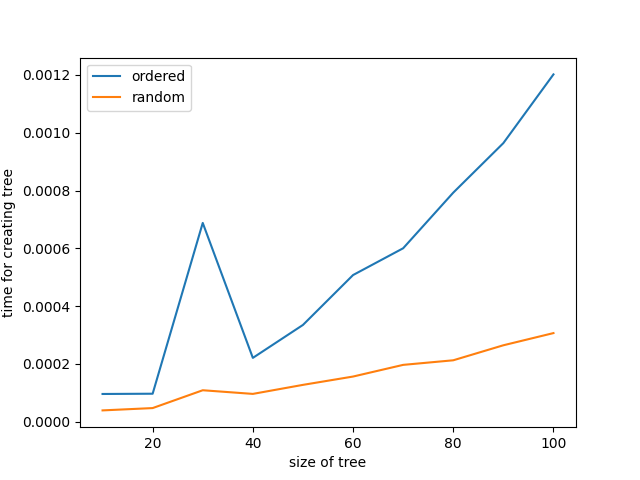

# binary search tree

## generate tree
sample_gen_tree() function in binary-search-tree.py

## print sorted key in the tree
sample_print_sorted_keys() function in binary-search-tree.py

## search a node 
sample_search() function in binary-search-tree.py

## search minimum and maximum
minimum(), maximum() function in binary-search-tree.py

## successor and predecessor
successor(), predecessor() function in binary-search-tree.py

## delete
sample_delete() function in binary-search-tree.py

## creating tree time
compare ordered numbers and random numbers  
`python compare-time.py`  

## creating and deleting tree animation
`python animation.py`

