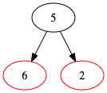
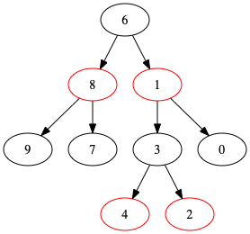

# 13 Red-Black Trees

## red_black_tree.py
### make a graph
`graph()` function

### insert a node
`insert_test()` function. you can see the graph in the graph directory

[5, 2, 6, 8, 0, 9, 1, 3, 4, 7]

### delete a node
`delete_test()` function. you can see the graph in the graph directory

[5, 2, 6, 8, 0, 9, 1, 3, 4, 7]

