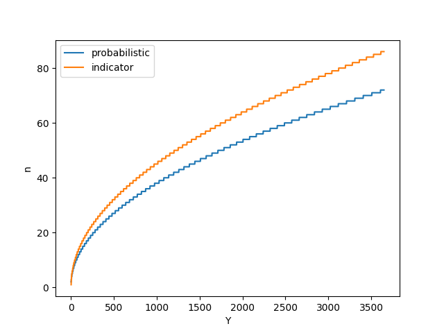

# 5 probabilistic analysis and randomized algorithms

## 5.1 The hiring problem
`python hiring.py`

## 5.4.2 Birthday paradox
`python birthday`

## 5.1-2 and 5.1-3 random generator
- create Random(a, b) function using Random(0, 1)
- create Random(0, 1) function using random number p (0<p<1)

`python random_generator` 