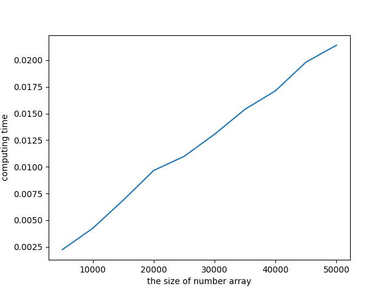
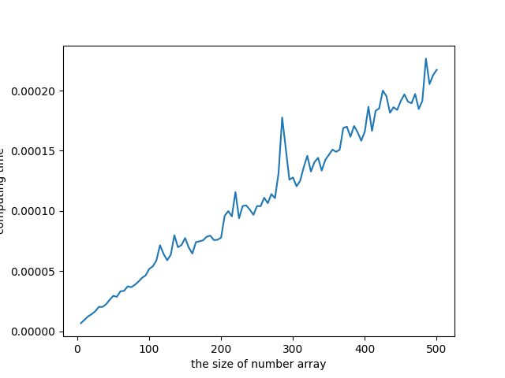

## Medians and Order Statistics

## 9.1 minimum and maximum
### find minimum
`python min_max.py` 
### find minimum and maximum, 3[n/2] - 2 comparing
`python min_max.py`

## 9.2 Selected Algorithm
### Run and Making a graph comparing the time of each size
`python random_select.py`  

